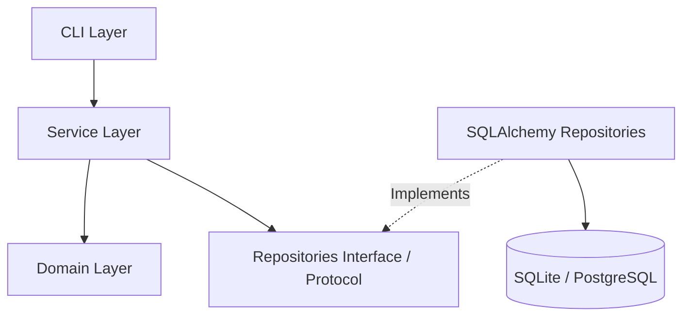

# Architecture

Project Sentinel follows Clean Architecture and Domain-Driven Design (DDD) principles.

## Module Structure

The codebase is organized into layers:

1. **Domain Layer (`src/project_sentinel/domain/`)**: Contains pure business logic, entities, value objects, and repository Protocol definitions.
   - Has zero dependencies on any database or external framework.
2. **Platform Core / Storage Layer (`src/project_sentinel/storage/` and `src/project_sentinel/platform/`)**: Implements repository Protocols using SQLAlchemy.
3. **Service Layer (`src/project_sentinel/services/`)**: Orchestrates business actions, coordinates between domain models and repositories.
4. **CLI Layer (`src/project_sentinel/cli/`)**: Command-line interface built using Typer to interact with services.
5. **Workflows / Integrations Layer (`src/project_sentinel/workflows/`, `src/project_sentinel/integrations/`)**: Future hooks for synchronization logic.

