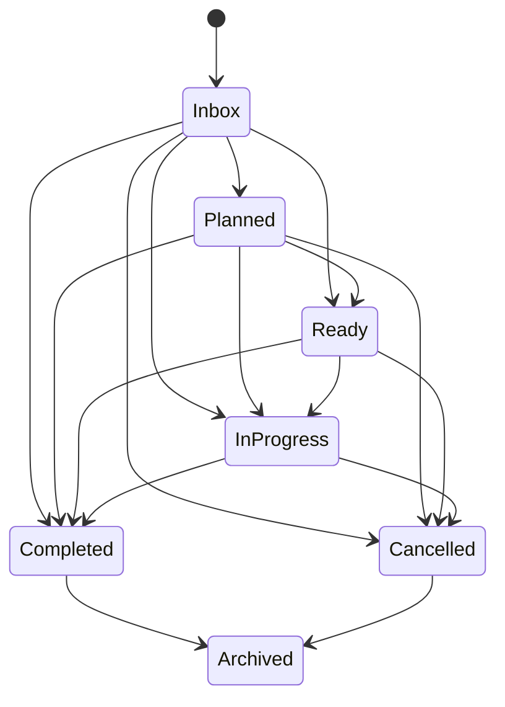

# Domain Model

## Core Entities

### Workspace
- Primary domain boundary. All items (Tasks, Projects, Notes) belong to a Workspace.
- Attributes: `id`, `name`, `is_default`, `created_at`, `updated_at`.

### Project
- Optional organizational group within a Workspace.
- Attributes: `id`, `name`, `workspace_id`, `created_at`, `updated_at`.

### Task
- Represents actionable work.
- Attributes:
  - `title`, `description`, `status` (Status enum), `priority` (Priority enum), `importance` (Importance enum)
  - `tags` (normalized list of strings)
  - `due_date`, `scheduled_date`
  - Recurrence: `recurring`, `repeat_every`, `repeat_unit`
  - Work Logs: `estimated_minutes`, `actual_minutes`
  - Hierarchy: `parent_task_id`, `project_id`, `workspace_id`
  - Dependency Graph: `depends_on`, `blocked_by`

## Task Status Workflow

